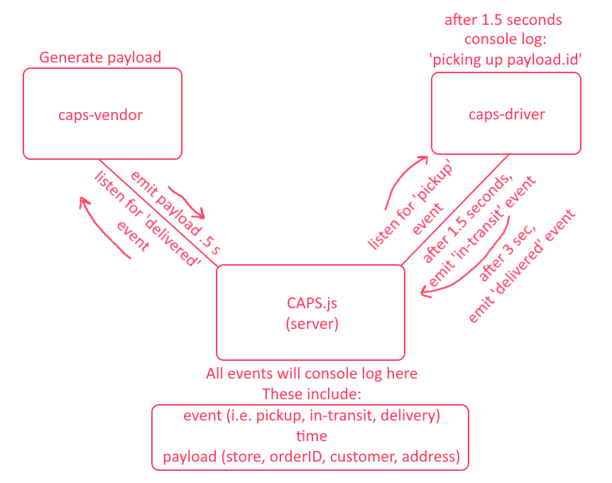

# CAPS SERVER FILE

## This lab simulates the cycle a system goes through when a package is requested to be picked up, in-transit, and finally delivered to the client.

What the dataflow looks like:

A LOT of the testing suite was taken and edited a bit from [here](https://medium.com/@tozwierz/testing-socket-io-with-jest-on-backend-node-js-f71f7ec7010f).

